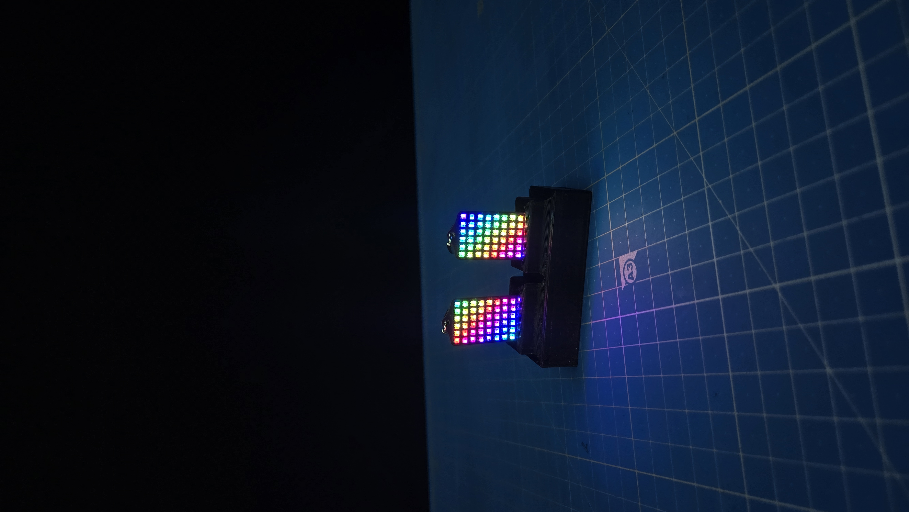

# ✨ TetrisEarrings

Серьги на светодиодной матрице 6×10 с девятью завораживающими анимированными режимами — от пинг-понга и тетриса с автономным ботом до огня, звёздного неба и дождя на стекле.

[](LICENSE)


<p align="center">
  
</p>

## О проекте

Маленькая плата на STM32 прячется в серьге и управляет матрицей из 60 адресных RGB-светодиодов (6 столбцов × 10 строк). Одна кнопка переключает режимы вручную, либо они сами сменяют друг друга каждые 45 секунд. Устройство работает от аккумулятора и умеет само выключаться — как по долгому нажатию кнопки, так и при разряде батареи, с небольшой прощальной анимацией.

## Возможности

- 🎮 **9 режимов** — от классических игр до генеративных визуальных эффектов
- 🧠 **Тетрис с "умным" ботом** — фигура не падает как попало: перед каждым падением бот перебирает все повороты и колонки и выбирает размещение по эвристике (минимум дыр, минимум высоты и перепадов, максимум собранных линий)
- 🐍 **Змейка с автономным ботом** — сама выбирает путь до еды и не врезается в себя
- 🎨 **Субпиксельное сглаживание** — мячики в пинг-понге двигаются плавно, а не скачками между светодиодами
- 🔋 **Умное питание** — автослежение за напряжением батареи и автовыключение при разряде
- 📺 **Анимация выключения** — экран "схлопывается" в точку и гаснет, как у старых кинескопных телевизоров
- 🧩 **Всё в 6 КБ RAM** — все режимы делят одну и ту же область памяти (union), а не держат данные каждого режима отдельно

## Режимы

| № | Режим | Описание |
|---|---|---|
| 0 | Пинг-понг | Три мячика летают и сталкиваются друг с другом, при ударе меняют цвет |
| 1 | Тетрис | Автономная игра с ботом, который осмысленно выбирает, куда положить фигуру |
| 2 | Змейка | Автономная игра, бот сам ведёт змейку к еде |
| 3 | Сердце | Плавно пульсирующее сердце |
| 4 | Огонь | Процедурная имитация живого пламени с искрами |
| 5 | Матрица | Падающие зелёные "цифровые капли" в духе фильма "Матрица" |
| 6 | Звёздное небо | Редкие вспышки звёзд разных оттенков с плавным угасанием |
| 7 | Радуга | Диагональная переливающаяся радужная волна |
| 8 | Дождь на стекле | Капли стекают вниз и разлетаются брызгами при ударе о дно |

Короткое нажатие кнопки — следующий режим, удержание около секунды — выключение (с анимацией). Без нажатий режимы сами сменяют друг друга каждые 45 секунд.

## Железо

| Параметр | Значение |
|---|---|
| Микроконтроллер | STM32F070F6Px (Cortex-M0, 48 МГц, 32 КБ Flash, 6 КБ RAM) |
| Матрица | 6×10 (60 шт.) адресных RGB-светодиодов, WS2812-совместимый протокол |
| Линия данных матрицы | PA9 (TIM1_CH2 + DMA, побитовое ШИМ-кодирование сигнала) |
| Кнопка | PA7 |
| Управление питанием | PA6 (самоблокировка/отключение питания платы) |
| Контроль батареи | PA1 (ADC1_IN1), автовыключение при разряде |
| Среда разработки | STM32CubeIDE 1.17.0, GNU Arm Embedded Toolchain 12.3.rel1 |

Светодиоды матрицы соединены «змейкой»: чётные строки идут в одну сторону, нечётные — в другую (см. `GetLEDIndex()` в [ledMatrix.c](Core/Src/ledMatrix.c)).

## Электроника (Altium)

Исходники платы (схема, разводка, BOM) в Altium Designer: **[ссылка появится здесь]**

> Когда проект будет выложен на Google Drive — замените эту строку на ссылку.

## Сборка и прошивка

1. Клонировать репозиторий и открыть папку проекта в **STM32CubeIDE 1.17.0** (File → Import → General → Existing Projects into Workspace).
2. Выбрать конфигурацию сборки:
   - **Debug** — полные отладочные символы, оптимизация `-Og` (специально подобрана, чтобы прошивка помещалась в 32 КБ флеша чипа и при этом хорошо отлаживалась);
   - **Release** — сборка `-Os`, минимальный размер.
3. **Project → Build Project**.
4. Прошить через ST-Link: **Run → Debug** (или **Run**) при подключенном программаторе.

## Структура проекта

```
Core/
├── Inc/                  # Заголовки
│   ├── effects.h          # Визуальные эффекты
│   ├── games.h            # Тетрис и Змейка
│   ├── ledMatrix.h        # Драйвер WS2812
│   └── saportAndData.h    # Общее состояние (пины, общая память режимов)
└── Src/
    ├── main.c              # Точка входа, инициализация периферии
    ├── work.c               # Диспетчер режимов, кнопка, АЦП, автовыключение
    ├── effects.c             # Пинг-понг, Огонь, Матрица, Звёзды, Радуга, Дождь, Сердце
    ├── games.c               # Тетрис (с ИИ-ботом) и Змейка (с автономным ботом)
    └── ledMatrix.c            # Драйвер адресной матрицы поверх TIM1 + DMA
```

## Лицензия

Проект распространяется под лицензией [MIT](LICENSE).
